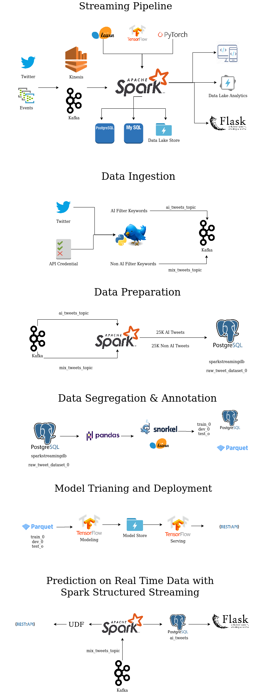

# [Fullstack Data Science Examples  with Structured Streaming](https://gyan42.github.io/spark-streaming-playground/)

The aim of the this project is to create a zoo of Big Data frameworks on a single machine,
where pipelines can be build and tested based on Twitter stream. Which involves but not limited to fetch,
store the data in data lake, play around with the Spark Structured SQLs for processing, create dataset from live 
stream for Machine Learning and do interactive visualization from the data lake.


## What is [Spark Streaming](https://techvidvan.com/tutorials/spark-streaming/)?   

First of all, what is streaming? A data stream is an unbounded sequence of data arriving continuously. 
Streaming divides continuously flowing input data into discrete units for processing. Stream processing is low latency 
processing and analyzing of streaming data. Spark Streaming is an extension of the core Spark API that enables scalable, 
high-throughput, fault-tolerant stream processing of live data. Spark Streaming is for use cases which require a 
significant amount of data to be quickly processed as soon as it arrives. Example real-time use cases are:

- Website monitoring, network monitoring
- Fraud detection
- Web clicks
- Advertising
- Internet of Things sensors

Spark Streaming supports data sources such as HDFS directories, TCP sockets, Kafka, Flume, Twitter, etc. 
Data Streams can be processed with Spark’s core APIS, DataFrames SQL, or machine learning APIs, and can be persisted 
to a filesystem, HDFS, databases, or any data source offering a Hadoop OutputFormat.

- [Spark Streaming Playground Environment Setup](https://gyan42.github.io/spark-streaming-playground/build/html/setup/setup.html)
- [Learning Materials](https://gyan42.github.io/spark-streaming-playground/build/html/tutorials.html)
- [Localhost Port Number used](https://gyan42.github.io/spark-streaming-playground/build/html/host_urls_n_ports.html)
- [How to Run?](https://gyan42.github.io/spark-streaming-playground/build/html/how_to_run.html)
- [Usecases](https://gyan42.github.io/spark-streaming-playground/build/html/usecases/usecases.html)     
    

**Sanity test**

Run pytest to check everything works fine...
```
pytest -s
pytest -rP #shows the captured output of passed tests.
pytest -rx #shows the captured output of failed tests (default behaviour).
```

**Build Documents**
```
cd docs
make ssp
```

## Medium Post @ [https://medium.com/@mageswaran1989/big-data-play-ground-for-engineers-intro-71d7c174dfd0](https://medium.com/@mageswaran1989/big-data-play-ground-for-engineers-intro-71d7c174dfd0)


## Block Chain and Streaming

https://github.com/dhiraa/blockchain-streaming
