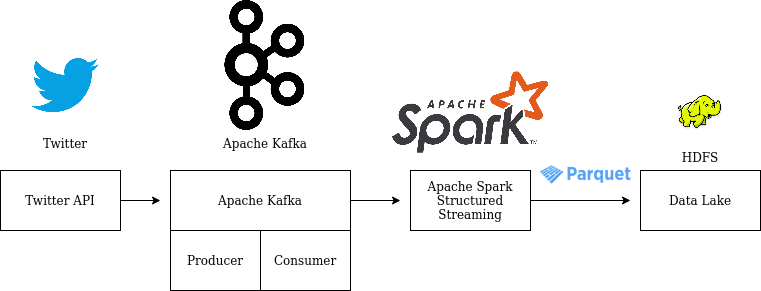

# Dump Tweet data into Data Lake

## Requirements  

- Come up with a [Data Lake](https://aws.amazon.com/big-data/datalakes-and-analytics/what-is-a-data-lake/) storage system.  
    Data lake setup should be as follows on our HDFS, basically boils down to HDFS paths:  
    - Bronze Lake : Raw data i.e tweets  
    - Silver Lake : Preprocessed data like running some kind of NLP stuff like Nammed Entity Recoginition (NER), cleansing etc.,  
    - Gold Lake   : Data Ready for web application / dash board to consume    

- Have provision to collect tweets:
    - Related to `Data Science/AI/Machine Learning/Big Data` and dump into bronze lake
    - More generic along side of above tweets

------------------------------------------------------------------------------------------------------------------------

## Implementation Steps
  
- Get API Credentials from Twitter Developement Site  
- Setup [Tweepy](https://www.tweepy.org/) to read Twitter stream filtering tweets 
  that talks about `Data Science/AI/Machine Learning/Big Data`  
- Create Kafka topics for twitter stream  
- Dump the tweets from Tweepy into Kafka topics  
- Use Spark Structured Streaming to read the Kafka topic(s) and store as parquet in HDFS  
- Use HDFS command line ot verify the data dump  

Data flow path:
 ```
Twitter API -> Kafka Producer (two topics) -> Kafka Server  

Spark Structured Streaming with Kafka Consumer -> Parquet Sink -> Bronze Lake (HDFS location)
```



------------------------------------------------------------------------------------------------------------------------

## Configuration
- [Tweets Keywords Used](https://gyan42.github.io/spark-streaming-playground/build/html/ssp/ssp.utils.html#ssp.utils.ai_key_words.AIKeyWords)
- Config file used : [default_ssp_config.gin](https://github.com/gyan42/spark-streaming-playground/blob/756ee7c204039c8a3bc890a95e1da78ac2d6a9ee/config/default_ssp_config.gin)
- [TwitterProducer](https://gyan42.github.io/spark-streaming-playground/build/html/ssp/ssp.kafka.producer.html)

------------------------------------------------------------------------------------------------------------------------

## How to run?

There are two ways of running, that is on docker or on your local machine. In either case, opening the terminal
is the difference, once the terminal is launched, the steps are common. 

To get a new terminal for our docker instance run :   
`docker exec -it $(docker ps | grep sparkstructuredstreaming-pg | cut -d' ' -f1) bash`
Note: We pull our container run id with `$(docker ps | grep sparkstructuredstreaming-pg | cut -d' ' -f1)`

This example needs three terminals:

- Producer [bin/data/start_kafka_producer.sh](https://github.com/gyan42/spark-streaming-playground/tree/master/bin/data/start_kafka_producer.sh)
    - `Twitter API -> Kafka Producer -> Kafka Server`
    - [src/ssp/spark/streaming/consumer/twiteer_stream_consumer_main.py](https://github.com/gyan42/spark-streaming-playground/tree/master/src/ssp/spark/streaming/consumer/twiteer_stream_consumer_main.py)    
- Consumer [bin/data/dump_raw_data_into_bronze_lake.sh](https://github.com/gyan42/spark-streaming-playground/tree/master/bin/data/dump_raw_data_into_bronze_lake.sh)
    - `Spark Structured Streaming with Kafka Consumer -> Parquet Sink -> Bronze Lake`
    - [src/ssp/spark/streaming/consumer/twiteer_stream_consumer_main.py](https://github.com/gyan42/spark-streaming-playground/tree/master/src/ssp/spark/streaming/consumer/twiteer_stream_consumer_main.py)
    - `spark-submit` is used to run the application.
    - Which submits the application to Spark master, if the application has SparkSession in it, then it will
      be considered as Spark Application and the cluster is used to run the application
    - Since cluster is involved in our example, we need to specify the number of cores, memory needed and maximum cores for our application,
      which is exported just before the spark-submit command in the shell script file.
    - Also the extra packages need for the application is given as part of the submit config
- HDFS 
    - Command line tool to test the parquet file storage
    
    
On each terminal move to source folder

- If it is on on local machine
```shell script 
# 
cd /path/to/spark-streaming-playground/ 
```

- If you wanted to run on Docker, then 'spark-streaming-playground' is mounted as a volume at `/host/`
```shell script
docker exec -it $(docker ps | grep sparkstructuredstreaming-pg | cut -d' ' -f1) bash
cd /host  
```

- [producer] <- custom (guake) terminal name!
``` 
export PYTHONPATH=$(pwd)/src/:$PYTHONPATH
vim bin/data/start_kafka_producer.sh
bin/data/start_kafka_producer.sh
```

- [visualize]
```
export PYTHONPATH=$(pwd)/src/:$PYTHONPATH
vim bin/data/visulaize_raw_text.sh
bin/data/visulaize_raw_text.sh
```

- [consumer]
```
export PYTHONPATH=$(pwd)/src/:$PYTHONPATH
vim bin/data/dump_raw_data_into_bronze_lake.sh
bin/data/dump_raw_data_into_bronze_lake.sh
```

- [hdfs]
```
export PYTHONPATH=$(pwd)/src/:$PYTHONPATH
export PYTHONPATH=$(pwd)/src/:$PYTHONPATH
hdfs dfs -ls /tmp/ssp/data/lake/bronze/delta/
```

------------------------------------------------------------------------------------------------------------------------

## Take Aways / Learning's 

- Understand how to get an Twitter API
- Learn to use Python library [Tweepy to listen to Twitter stream](http://docs.tweepy.org/en/latest/streaming_how_to.html)
- Understand creation of Kafka topic
    - ```sudo /opt/binaries/kafka/bin/kafka-topics.sh \
         --create 
         --zookeeper localhost:2181 \
         --replication-factor 1 
         --partitions 20 
         --topic {topic}``` 
- Dumping the data to Kafka topic : [TweetsListener](https://github.com/gyan42/spark-streaming-playground/tree/master/src/ssp/spark/streaming/consumer/twiteer_stream_consumer_main.py)
    - Define `KafkaProducer` with Kafka master url
    - Send the data to specific topic
- Using Spark Structured Streaming to read Kafka topic
    - Configuring the read stream
    - Defining the Schema as per [Twitter Json schema](https://developer.twitter.com/en/docs/tweets/data-dictionary/overview/tweet-object)
      in our [code](https://github.com/gyan42/spark-streaming-playground/blob/master/src/ssp/spark/streaming/common/twitter_streamer_base.py#L56)
- Using Spark Structured Streaming to store streaming data as [parquet](https://github.com/gyan42/spark-streaming-playground/blob/756ee7c204039c8a3bc890a95e1da78ac2d6a9ee/src/ssp/spark/streaming/common/streamer_base.py#L57) in HDFS/local path
- View the stored data with HDFS commands
    

