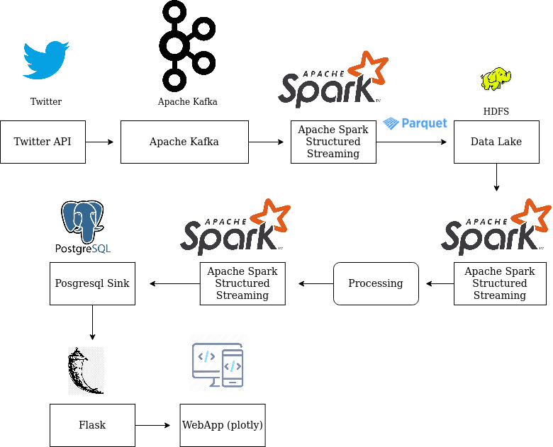
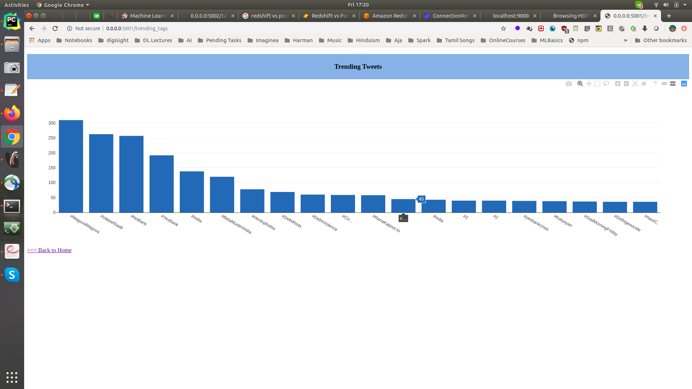

# Trending Twitter Hash Tags

## Requirements
- Read raw twitter data from Bronze lake
- Extract all hash tags in a new column
- Store the hash tags in Postgresql DB table
- Design a simple naive dash board with Bar charts for trending tweets 

------------------------------------------------------------------------------------------------------------------------

## Implementation

- Read the Bronze lake parquet raw data into Spark Structured input stream
- Create a new column with `UDF` to extract the hash tags and use `explode` on array of hash tags to create new row for each hashtag 
- With `foreachParition` API, dump the data into Postgresql DB table
- In Flask backend read the data from  Postgresql DB table
- Use plotly to create Bar chart and display it on the HTML page

Below is the data flow path:

```
Bronze Lake/Live Stream ---> Spark Structured Streaming Parquet Source ---> Extract Hash Tags with UDF --
                                    -> Spark Structured Streaming Postgresql Sink

Postgresql ---> Flask REST API ---> Web Application
```



------------------------------------------------------------------------------------------------------------------------


## Configuration
- [Tweets Keywords Used](https://gyan42.github.io/spark-streaming-playground/build/html/ssp/ssp.utils.html#ssp.utils.ai_key_words.AIKeyWords)
- Config file used : [default_ssp_config.gin](https://github.com/gyan42/spark-streaming-playground/blob/756ee7c204039c8a3bc890a95e1da78ac2d6a9ee/config/default_ssp_config.gin)
- [TwitterProducer](https://gyan42.github.io/spark-streaming-playground/build/html/ssp/ssp.kafka.producer.html)
- [TrendingHashTags](https://gyan42.github.io/spark-streaming-playground/build/html/ssp/ssp.spark.streaming.analytics.html#ssp.spark.streaming.analytics.trending_hashtags.TrendingHashTags)
- [PostgresqlConnection](https://gyan42.github.io/spark-streaming-playground/build/html/ssp/ssp.posgress.html#ssp.posgress.dataset_base.PostgresqlConnection)
- [trending_hashtags_flask.gin](https://github.com/gyan42/spark-streaming-playground/blob/756ee7c204039c8a3bc890a95e1da78ac2d6a9ee/config/trending_hashtags_flask.gin)

------------------------------------------------------------------------------------------------------------------------


## How to run?

There are two ways of running, that is on docker or on your local machine. In either case, opening the terminal
is the difference, once the terminal is launched, the steps are common. 

To get a new terminal for our docker instance run : `docker exec -it $(docker ps | grep sparkstructuredstreaming-pg | cut -d' ' -f1) bash`
Note: We pull our container run id with `$(docker ps | grep sparkstructuredstreaming-pg | cut -d' ' -f1)`

This example needs multiple terminals:

- Producer [bin/data/start_kafka_producer.sh](https://github.com/gyan42/spark-streaming-playground/tree/master/bin/data/start_kafka_producer.sh)
    - `Twitter API -> Kafka Producer -> Kafka Server`
    - [src/ssp/spark/streaming/consumer/twiteer_stream_consumer_main.py](https://github.com/gyan42/spark-streaming-playground/tree/master/src/ssp/spark/streaming/consumer/twiteer_stream_consumer_main.py)    
- Hashtag [bin/trending_tweet_hashtags.sh](https://github.com/gyan42/spark-streaming-playground/tree/master/bin/analytics/trending_tweet_hashtags.sh)
    - `Bronze Lake ---> Spark Structured Streaming Parquet Source ---> Extract Hash Tags with UDF ---> Spark Structured Streaming Postgresql Sink`
    - [src/ssp/spark/streaming/analytics/trending_hashtags_main.py](https://github.com/gyan42/spark-streaming-playground/tree/master/src/ssp/spark/streaming/analytics/trending_hashtags_main.py)    
- Dashboard [bin/flask/trending_hashtags_dashboard.sh](https://github.com/gyan42/spark-streaming-playground/tree/master/bin/flask/trending_hashtags_dashboard.sh)
    - `Postgresql ---> Flask REST API ---> Web Application`
    - [src/ssp/flask/dashboard/app.py](https://github.com/gyan42/spark-streaming-playground/tree/master/src/ssp/flask/dashboard/app.py)
    

On each terminal move to source folder

- If it is on on local machine
```shell script 
# 
cd /path/to/spark-streaming-playground/ 
```

- If you wanted to run on Docker, then 'spark-streaming-playground' is mounted as a volume at `/host/`
```shell script
docker exec -it $(docker ps | grep sparkstructuredstreaming-pg | cut -d' ' -f1) bash
cd /host  
```

- [producer] <- Guake terminal name! 
```
export PYTHONPATH=$(pwd)/src/:$PYTHONPATH
vim bin/data/start_kafka_producer.sh
bin/data/start_kafka_producer.sh
```

- [hashtag] 
```
export PYTHONPATH=$(pwd)/src/:$PYTHONPATH
vim bin/analytics/trending_tweet_hashtags.sh
bin/analytics/trending_tweet_hashtags.sh
```

- [dashboard]
```
export PYTHONPATH=$(pwd)/src/:$PYTHONPATH
vim bin/flask/trending_hashtags_dashboard.sh
bin/flask/trending_hashtags_dashboard.sh
```
 
Head to http://0.0.0.0:5001/ for live count on the trending #hashtags
 

------------------------------------------------------------------------------------------------------------------------
 
## Take Aways / Learning's 
- Covers the previous [use case learnings](https://gyan42.github.io/spark-streaming-playground/build/html/usecases/1_dump_tweets.html#take-aways-learning-s)
- How to [dump the processed streaming data to Postgresql](https://github.com/gyan42/spark-streaming-playground/blob/756ee7c204039c8a3bc890a95e1da78ac2d6a9ee/src/ssp/spark/streaming/analytics/trending_hashtags.py#L94)
- How to use the [Flask and Python to read the data from Postgres and create a bar chart on a naive dashboard](https://github.com/gyan42/spark-streaming-playground/blob/756ee7c204039c8a3bc890a95e1da78ac2d6a9ee/src/ssp/flask/trending_hashtags/app.py#L18)

------------------------------------------------------------------------------------------------------------------------

**References**
For people who are looking for more advanced dashboard can refer these links:
- [https://medium.com/analytics-vidhya/building-a-dashboard-app-using-plotlys-dash-a-complete-guide-from-beginner-to-pro-61e890bdc423](https://medium.com/analytics-vidhya/building-a-dashboard-app-using-plotlys-dash-a-complete-guide-from-beginner-to-pro-61e890bdc423)
- [https://towardsdatascience.com/how-to-build-a-complex-reporting-dashboard-using-dash-and-plotl-4f4257c18a7f](https://towardsdatascience.com/how-to-build-a-complex-reporting-dashboard-using-dash-and-plotl-4f4257c18a7f)
- [https://github.com/Chulong-Li/Real-time-Sentiment-Tracking-on-Twitter-for-Brand-Improvement-and-Trend-Recognition](https://github.com/Chulong-Li/Real-time-Sentiment-Tracking-on-Twitter-for-Brand-Improvement-and-Trend-Recognition) (TODO)
- [http://davidiscoding.com/real-time-twitter-analysis-4-displaying-the-data](http://davidiscoding.com/real-time-twitter-analysis-4-displaying-the-data)