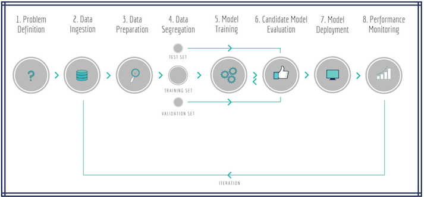
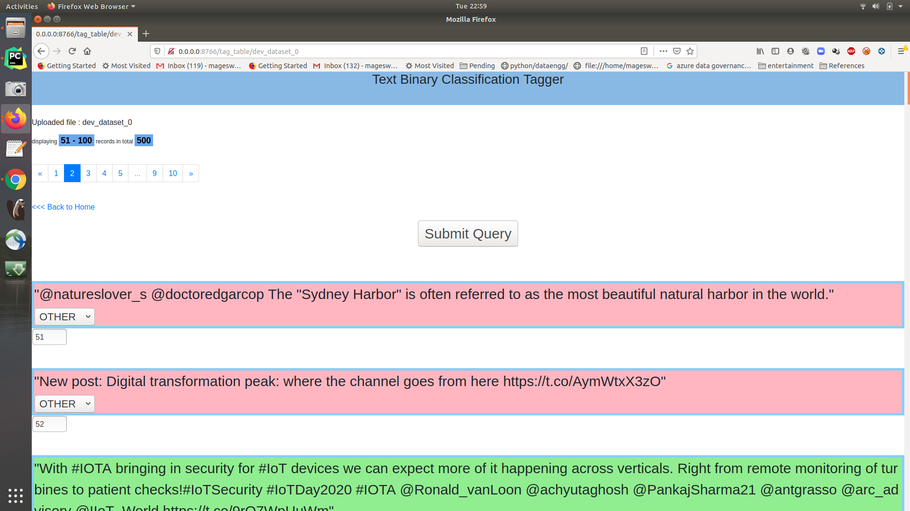

# Streaming ML Classification with Active Learning Model

## Requirements  

- Refer the following link for general architecture of our continuous integration ML pipeline[theory on Architecting a Machine Learning Pipeline](https://towardsdatascience.com/architecting-a-machine-learning-pipeline-a847f094d1c7)   
- Create a pipeline imitating the following diagram...   
    
- Build ground up dataset for tweet classification from scratch with the live streaming data
- Dump the raw tweet data into a table in Postgresql DB called `streamingdb`
- Have configuration to prefix the name of raw tweet data and up on each data ingestion run the prefix should be used with incrementing suffix index
- Use semi supervised methods to tag dataset, for example frameworks like [https://www.snorkel.org/](https://www.snorkel.org/
- Build a UI tool to annotate the semi supervised tagged data to create golden dataset for ML training
- Build a Naive Deep Learning/ Neural network model and evaluate it on golden/sem supervised dataset
- Deploy the model, classify the text
- Extract the web links from tweets and store the urls

## Implementation

1. Problem Definition
    - Build a modular streaming ML/DL pipeline 
    
2. Data Ingestion / Data Collection:
    ```
    Tweets ---> Twitter Stream ---> Tweepy ---> Kafka Producer ---> Kafka Stream --
                   -> Spark Structured Streaming Consumer ---> Postgresql as one single raw data table
   ```

3. Data Preparation / Data Labelling and Segregation 
   ```shell script
   Posgresql ---> Raw Dataset Table ---> Split ---> Train/Test/Dev/Snorkel dataset tables --
                     -> SSPLabeler(Snorkel Labeler) ---> Labelled Train/Test/Dev dataset stored in Postgresql & Disk
   Labelled Train/Test/Dev dataset on Posgresql---> Mannual UI Tagger --->  Train/Test/Dev dataset with golden label column on Posgresql
   ```

4. Model Training and Evaluation
    ```shell script
   Labelled Train/Test/Dev dataset ---> DL Model ---> Model Store
   ```

5. Deployment / Prediction on Live Stream
   ```shell script
   Model Store ---> Tensorflow Serving ---> TF API End Point
   Tweets ---> Twitter Stream ---> Tweepy ---> Kafka Producer ---> Kafka Stream  --
                 -> Spark Structured Streaming Consumer ---> UDF(TF API End Point) --
                       -> Filtered AI Tweets ---> Postgresql
   ```

6. Monitoring / Dashboard
   ```
   Postgresql ---> Flask API ---> Dashboard
   ```

Dataset tables:
- Tables are suffixed with `run/version id` starting from `0`, refer respective bin/*.sh files for version configurations

|Table Name                        |Records|Info               |
|----------------------------------|-------|-------------------|
|raw_tweet_dataset_0               | 50K+  |Full Raw Dataset   |
|deduplicated_raw_tweet_dataset_0  | ~     |Depulicated on text column|
|test_dataset_0                    |1000   |Test dataset       |
|dev_dataset_0                     |500    |Dev dataset        |
|snorkel_train_dataset_0           |10K    |Snorkel train dataset | 
|train_dataset_0                   |~      |Model train dataset |

## How to run?

There are two ways of running, that is on docker or on your local machine. In either case, opening the terminal
is the difference, once the terminal is launched, the steps are common. 

To get a new terminal for our docker instance run : `docker exec -it $(docker ps | grep sparkstructuredstreaming-pg | cut -d' ' -f1) bash`
Note: We pull our container run id with `$(docker ps | grep sparkstructuredstreaming-pg | cut -d' ' -f1)`

This example needs multiple terminals:

- On each terminal move to the source root folder:
    ```shell script
    # Local machine
    cd /path/to/spark-streaming-playground/ 
    
    # On Docker 'spark-streaming-playground' is mountes as a volume at /host/
    cd /host  
    
    export PYTHONPATH=$(pwd)/src/:$PYTHONPATH
    ```

- Data collection
    - There can be of two ways
    - First way is dumping data from live stream, which may take few hours depending up on the 
    frequency of the AI/ML/Big Data tweets
    ```shell script
    #[producer] Guake terminal name! 
        vim bin/data/start_kafka_producer.sh
        bin/data/start_kafka_producer.sh
    
    #[dump data]
        #by default 50K tweets (25K AI tweets + 25K False positive) will be collected and dumbed into the table
        vim bin/data/dump_raw_data_into_postgresql.sh
        bin/data/dump_raw_data_into_postgresql.sh
    ```
    - Second way is use the dump as part of this repo      
    ```shell script
    python src/ssp/posgress/dataset_base.py --mode=upload
  
    # If there is any Postgresql permission error related to schema, run below command on `psql` terminal
    GRANT ALL ON schema public TO sparkstreaming;
 
    ```

- Data preparation for model training, with default snorkel labeller
    ```shell script
    #[ssp data]
        vim bin/data/prepare_ssp_dataset.sh # check the version points to the one we wanted, to begin with it has to be 0
        vim config/default_ssp_config.gin # check for `SSPMLDataset` params
        bin/data/prepare_ssp_dataset.sh
    ```
  Snorkell Label Function coverage will be printed as part of the logs, as follows:
  ```shell script
                          j Polarity  Coverage  Overlaps  Conflicts
    is_ai_tweet         0      [1]    0.3125    0.0587     0.0587
    is_not_ai_tweet     1      [0]    0.3469    0.1597     0.0000
    not_data_science    2      [0]    0.1084    0.0983     0.0482
    not_neural_network  3      [0]    0.0036    0.0030     0.0030
    not_big_data        4      [0]    0.1133    0.1048     0.0057
    not_nlp             5      [0]    0.0132    0.0120     0.0004
    not_ai              6      [0]    0.0084    0.0067     0.0059
    not_cv              7      [0]    0.0081    0.0068     0.0016
    Training LabelModel
  ``` 

- Mannual tagger
    
    ```shell script
    #[tagger]
        bin/flask/tagger.sh
    ```
    
- Evalaute the Snorkel labeller with respect to hand labels
    ```shell script
    #[snorkell]
        bin/models/evalaute_snorkel_labeller.sh
    ```

- Train Deep Learning model 
    ```shell script
    #[DL Text classification Model]
        bin/models/build_naive_dl_text_classifier.sh 
    ```
- Start Tensorflow Serving
    ```shell script
    #[Tensorflow Serving]
        export MODEL_DIR=/home/mageswarand/ssp/model/raw_tweet_dataset_2/naive_text_classifier/exported/
        # test the model 
        saved_model_cli show --dir ${MODEL_DIR}/1/ --all
        # start the serving server
        tensorflow_model_server \
          --rest_api_port=8501 \
          --model_name="naive_text_clf" \
          --model_base_path="${MODEL_DIR}"
    ```

- Start live Spark streaming for AI/Data Science tweet classification
    ```shell script
    # [Spark Streaming]
        bin/nlp/spark_dl_text_classification_main.sh
    ```

**References**
- https://towardsdatascience.com/custom-transformers-and-ml-data-pipelines-with-python-20ea2a7adb65
- https://towardsdatascience.com/how-to-build-a-complex-reporting-dashboard-using-dash-and-plotl-4f4257c18a7f
- https://github.com/ucg8j/awesome-dash
- https://github.com/tensorflow/serving
- https://github.com/tensorflow/serving/blob/master/tensorflow_serving/g3doc/serving_kubernetes.md TODO